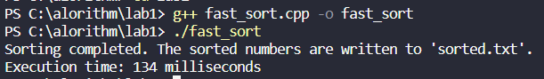
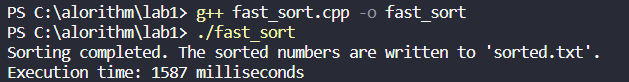
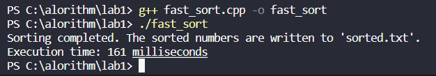
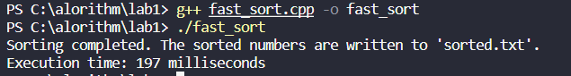

# 快速排序算法及其优化

## PB21020706姜一夫

### 算法思想

我们的快速排序算法基本思想是：
1.选择一个基准元素：从待排序的元素中选择一个元素作为基准（pivot）元素
2.分区操作：将待排序的元素按照与基准元素的大小关系，分成两个子序列。一个子序列中的元素小于等于基准元素，而另一个子序列中的元素大于基准元素
3.递归排序：对两个子序列进行递归排序。即重复步骤 1 和步骤 2，直到每个子序列只包含一个元素为止
4.合并结果：将排序好的子序列合并，得到最终有序的序列

我们优化快速排序算法的基本策略是
当输入数据已经“几乎有序”时，使用插入排序速度很快。我们可以利用这一特点来提高快速排序的速度。当对一个长度小于k的子数组调用快速排序时，让她不做任何排序就返回。上层的快速排序调用返回后，对整个数组运行插入排序来完成排序过程

### 关键代码

```cpp
// 快速排序
void quickSort(std::vector<int>& arr, int low, int high, int threshold) {
    if (low < high) {
        if (high - low + 1 <= threshold) {
            insertionSort(arr, low, high);
        } else {
            int pivot = arr[low]; // 使用第一个元素作为基准
            int i = low + 1;
            int j = high;

            while (i <= j) {
                if (arr[i] <= pivot) {
                    i++;
                } else if (arr[j] > pivot) {
                    j--;
                } else {
                    std::swap(arr[i], arr[j]);
                }
            }

            swap(arr[low], arr[j]);

            quickSort(arr, low, j - 1, threshold);
            quickSort(arr, j + 1, high, threshold);
        }
    }
}
```

### 实验结果分析

运行结果:
以固定基准设计代码运行的结果



以快速基准设计代码运行的结果



以三数取中设计代码运行的结果



借助插入排序优化后的代码运行的结果



将快速排序与归并排序，堆排序，冒泡排序进行比较
1.时间复杂度
快速排序的平均时间复杂度为 O(nlogn)，最坏情况下为 O(n^2)。最好情况下，当每次选择的基准元素都能将序列均匀地分成两部分时，快速排序的时间复杂度达到最佳
归并排序的时间复杂度始终为 O(nlogn)，无论是最好情况还是最坏情况。归并排序的时间复杂度相对稳定，但由于需要额外的空间来存储临时数组，因此它的空间复杂度较高
堆排序的时间复杂度为 O(nlogn)。堆排序的主要时间消耗在建堆和调整堆的过程中，建堆的时间复杂度为 O(n)，每次调整堆的时间复杂度为 O(logn)
冒泡排序的时间复杂度为 O(n^2)。冒泡排序的主要时间消耗在比较和交换元素的过程中，最好情况下（序列已经有序），冒泡排序的时间复杂度为 O(n)
2.空间复杂度
快速排序是一种原地排序算法，不需要额外的存储空间，因此其空间复杂度为 O(1)
归并排序需要额外的存储空间来存储临时数组，其空间复杂度为 O(n)
堆排序是一种原地排序算法，不需要额外的存储空间，因此其空间复杂度为 O(1)
冒泡排序是一种原地排序算法，不需要额外的存储空间，因此其空间复杂度为 O(1)
3.稳定性
快速排序是不稳定的排序算法，因为在分区操作中，相同元素的相对顺序可能会改变
归并排序是稳定的排序算法，因为在合并过程中，相同元素的相对顺序不会改变
堆排序是不稳定的排序算法，因为在堆的调整过程中，相同元素的相对顺序可能会改变
冒泡排序是稳定的排序算法，因为相邻元素的比较和交换只在相邻元素不满足排序顺序时进行
